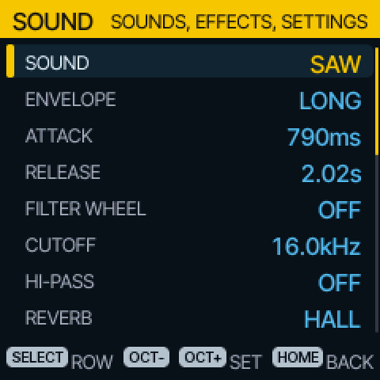
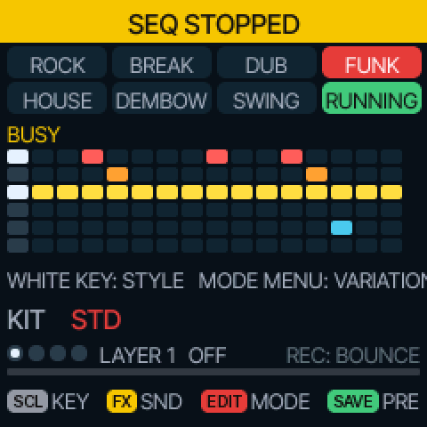
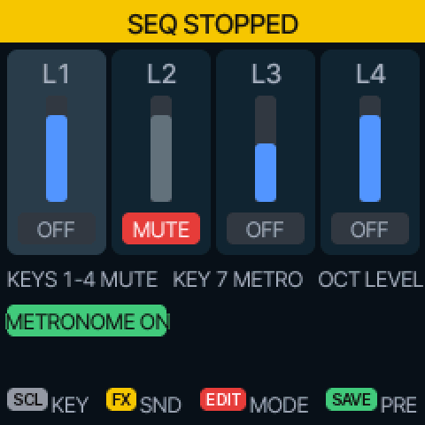

# fm1-chord

A custom firmware that turns the M-VAVE FM-1 pocket synth into a HiChord-style chord instrument.
Built on [Felucca](https://github.com/hugelton/Felucca). Clean-room: nothing from the HiChord's firmware.

**White keys play chords.** Each white key is a scale degree in the current key and scale, so every
chord fits: C4 is I, D4 is ii, and so on, across two octaves.

**Black keys change them.** The eight black keys of the middle octaves are the HiChord's joystick
directions (7ths, 9ths, sus, dim, aug, borrowed chords, in four tables); F#3 inverts, G#3 locks the
change to a key, A#3 holds.

**Everything else the HiChord does:** Play, Strum, Lead, Drone, Arp, Repeat, a 16-step chord
sequencer, drum pads, 56 drum loops, a 4-layer looper, a mixer, Chord Hiro and the Ear Trainer; 36 sounds,
7 envelope presets, reverb, delay, chorus, flanger, tremolo, vibrato, glide, drive, tape, stereo, a filter
wheel; key, scale, bass, voices, voice leading; four presets; MIDI in and out. Only the mic features are missing.

Three menus on three buttons, colour-coded like the HiChord's: **SCL** key (grey), **FX** sound
(yellow), **EDIT** mode (red), **SAVE** presets. HOME held gives you Felucca's full synth underneath.

| | |
|---|---|
|  |  |
|  |  |
|  |  |
|  |  |
|  |  |

Status: complete and tested on the host simulator; not yet run on hardware. Spec and notes in
[spec/docs](spec/docs). Build and flash: [spec/docs/05-dev-setup.md](spec/docs/05-dev-setup.md).
GPL-3.0, as Felucca.
