# fm1-chord

A custom firmware that turns the M-VAVE FM-1 pocket synth into a HiChord-style chord instrument.
Built on [Felucca](https://github.com/hugelton/Felucca). Clean-room: nothing from the HiChord's firmware.

**White keys play chords, then strum them.** The seven white keys at the left are the scale degrees
in the current key and scale, so every chord fits: the first is I, the next ii, up to vii. The nine
white keys to their right are a strumplate, as on an Omnichord: each plays one note of the chord
last played, rising from key to key, so a swipe across them strums it. The screen names the chord
and shows its notes on a piano; at rest it shows what every key does.

**Black keys change them.** The eight black keys of the middle octaves are the HiChord's joystick
directions (7ths, 9ths, sus, dim, aug, borrowed chords, in four tables); F#3 cycles the inversion
(C, C/E, C/G), G#3 locks a change to a key, A#3 holds. With BASS on SLASH (the default), the key held
first is the bass and the next one the chord: Em/C.

**Everything else the HiChord does:** Play, Strum, Lead, Drone, Arp, Repeat, a 16-step chord
sequencer, drum pads, 56 drum loops, a 4-layer looper, a mixer, Chord Hiro and the Ear Trainer; 37 sounds
(the HiChord's, plus an acoustic guitar for leads),
7 envelope presets, reverb, delay, chorus, flanger, tremolo, vibrato, glide, drive, tape, stereo, a filter
wheel; key, scale, bass, voices, voice leading; four presets; MIDI in and out. Only the mic features and
Bluetooth are missing.

**Controls.** Three menus on three buttons, colour-coded like the HiChord's: **SCL** key (grey),
**FX** sound (yellow), **EDIT** mode (red), **SAVE** presets. The PRESETS and ALGORITHM knobs pick the
sound and the mode from a list, ENV and LFO open theirs, KNOB 1 to 4 are filter, resonance, attack
and release with the value shown as you turn (KNOB 4 sets an effect's amount on its row in the sound
menu); tempo is on the mode menu and EDIT tapped three times. Chords over
drums: record the drum loop into a looper layer; the drum screens show the loop to time it. Your
settings come back after power-off. HOME held gives you Felucca's full synth underneath.

| | | |
|---|---|---|
| 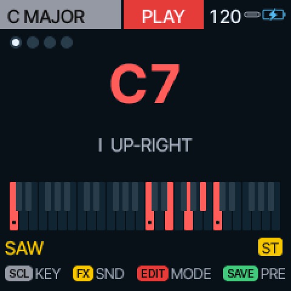 | 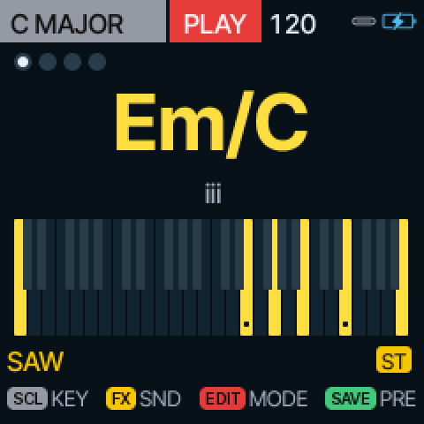 | 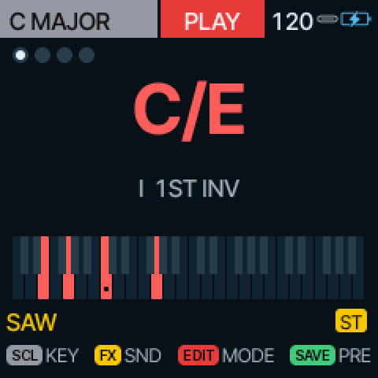 |
| 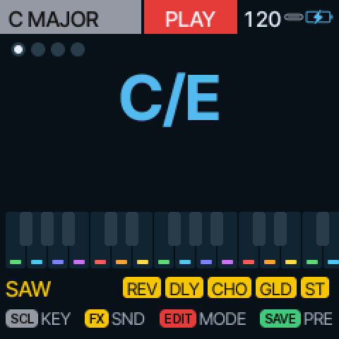 | 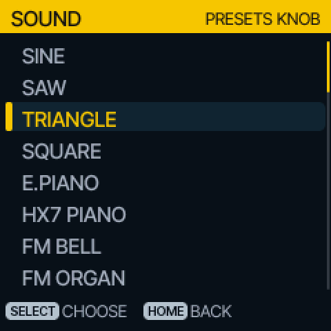 | 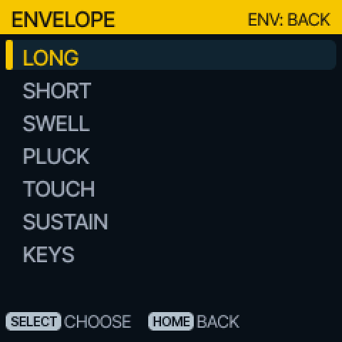 |
| 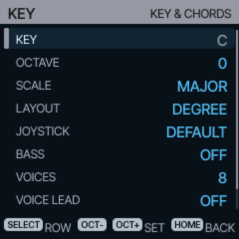 | 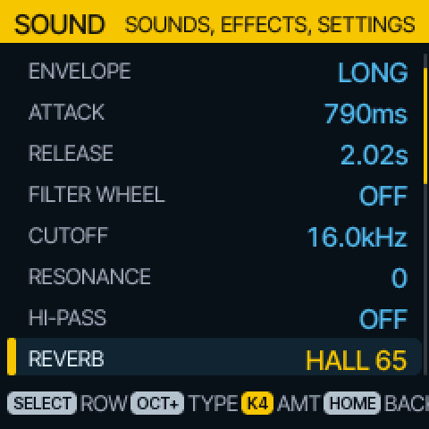 | 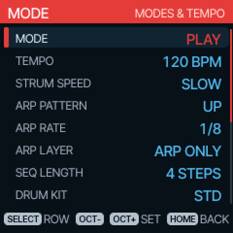 |
| 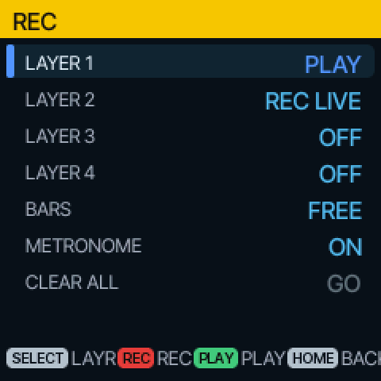 | 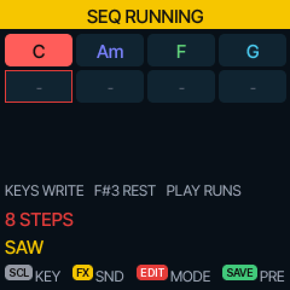 | 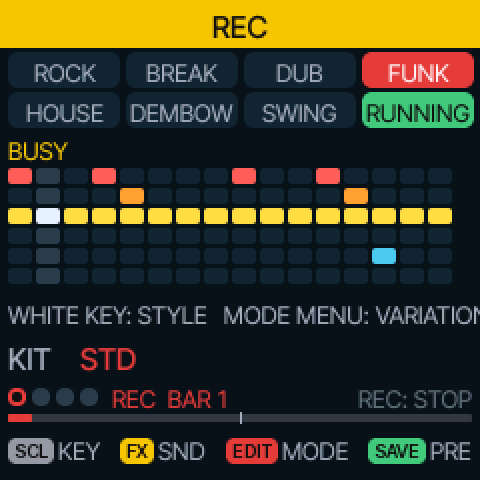 |
| 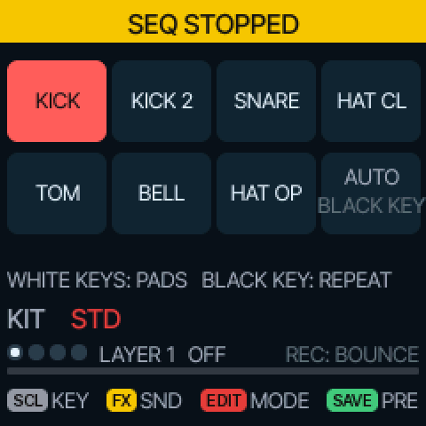 | 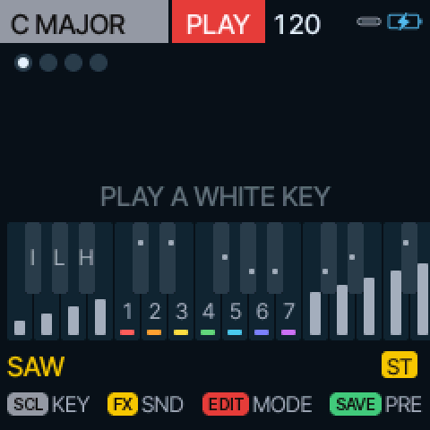 | 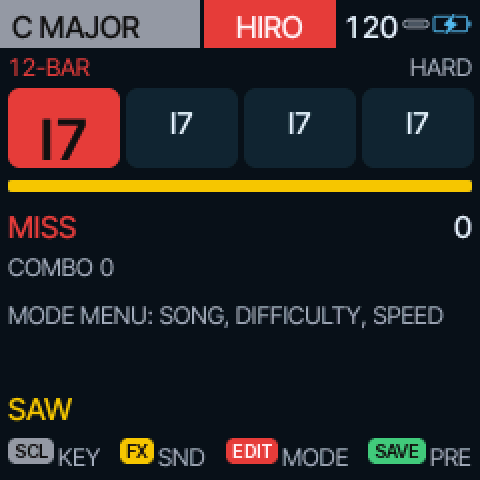 |

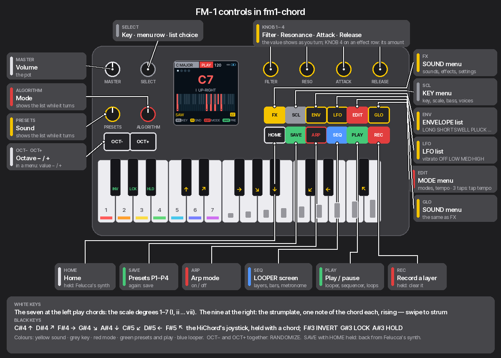

Status: running on an FM-1 (installed over USB-MIDI with `tools/fm1_install.py`, 28 % CPU at idle)
and tested on the host simulator. It also runs in the
[FM-1 emulator](https://github.com/simonjohansson/fm1-emulator) with a patch set on its released
build that adds the knobs and WAV recording: `tools/emulator/run.sh` fetches, patches, builds and
launches it. Factory reset: hold HOME + SAVE while powering on, or `factory yes` on the USB console.
Spec and notes in [spec/docs](spec/docs); build, flash and the findings on the unit in
[spec/docs/05-dev-setup.md](spec/docs/05-dev-setup.md) and [spec/docs/11-hardware-findings.md](spec/docs/11-hardware-findings.md).
GPL-3.0, as Felucca.
